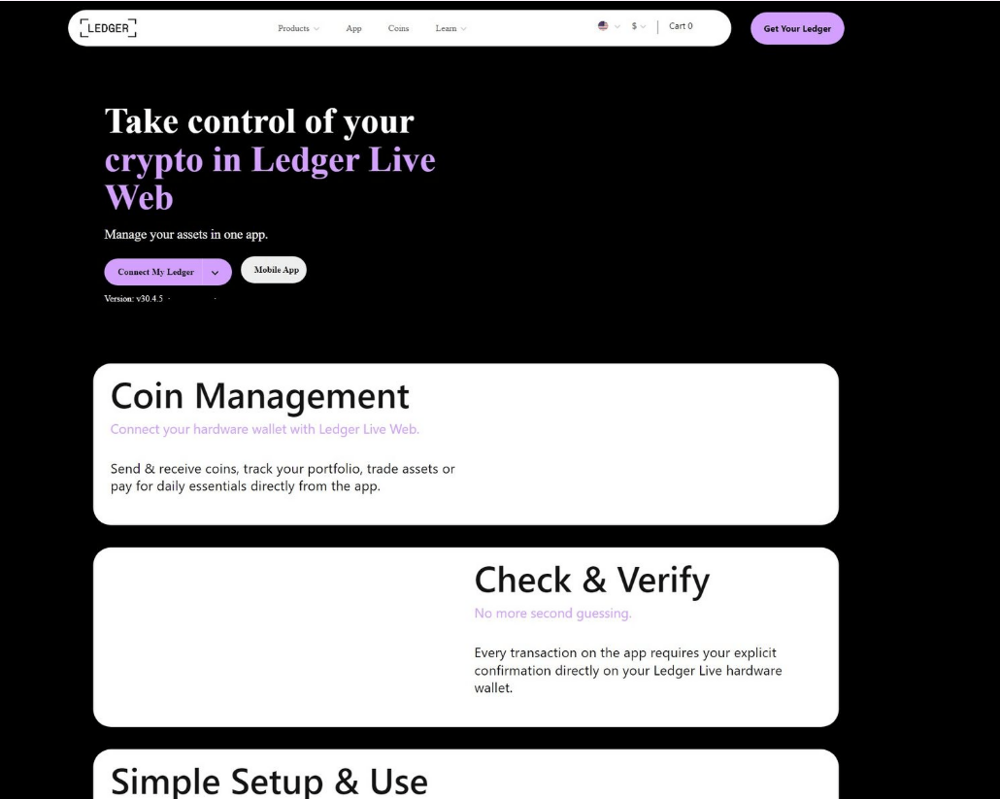

# Phishing Email/URL Analysis

Analysis of 3 real, publicly-reported phishing URLs sourced from PhishTank, investigated using VirusTotal and URLScan.io. Each sample includes hosting/infrastructure analysis, IOC extraction, and a documented verdict with reasoning.

---

## Sample 1: Fake Instagram Login Page

**Source:** PhishTank ID #9487837
**URL:** `https://authentication-login-page.duckdns.org/`
**Date Analyzed:** July 26, 2026

### Hosting Analysis
- Hosted on **DuckDNS** (free dynamic DNS), IP `13.50.248.23`, on **Amazon AWS** infrastructure (Stockholm, Sweden region)
- TLS certificate issued **July 25, 2026** — just 1 day before this scan — typical of short-lived, disposable phishing infrastructure
- Loads fonts/icons via Cloudflare (104.17.24.14) to visually replicate Instagram's real design (Font Awesome, cdnjs detected)

### URL/Link Analysis
- **VirusTotal: 15/92 engines flagged as Phishing/Malicious** (BitDefender, Kaspersky, Fortinet, Sophos, Google Safe Browsing, Netcraft, and others)
- **URLScan.io Page Title: "Instagram — Login"**
- Google Safe Browsing: **Malicious**
- Page returns HTTP 200 (live), active password-input field confirmed

### IOCs Extracted
- Malicious URL: `https://authentication-login-page.duckdns.org/`
- Malicious domain: `authentication-login-page.duckdns.org`
- Hosting IP: `13.50.248.23`
- Impersonated brand: **Instagram**

### Verdict: **Malicious**
Confirmed credential-harvesting page impersonating Instagram's login screen, hosted on abused free DNS infrastructure with a freshly-issued TLS certificate. 15+ security vendors and Google Safe Browsing corroborate this classification.

---

## Sample 2: Fake Ledger Live Download Page

**Source:** PhishTank ID #9487829
**URL:** `https://ledger-com-stariit.webflow.io/`
**Date Analyzed:** July 26, 2026

### Hosting Analysis
- Hosted on **Webflow.io**, fronted by multiple Cloudflare IPs plus one AWS IP — distributed across cloud providers
- TLS certificate issued **July 25, 2026** (1 day old) — same disposable-infrastructure pattern as Sample 1
- **Page Title: "Ledger® Live*Download - Secure (webflow)"** — directly impersonates Ledger Live, the companion app for Ledger crypto hardware wallets

### URL/Link Analysis
- **VirusTotal: 18/92 engines flagged as Phishing/Malicious** (BitDefender, ESET, Kaspersky, Fortinet, Sophos, LevelBlue, Netcraft, Webroot, and others)
- **URLScan.io's own verdict: "Potentially Malicious"**, explicitly identifying the targeted brand as **"Ledger (Crypto Exchange)"**
- Page uses jQuery to build a convincing fake "Connect My Ledger" interface mimicking the real Ledger Live Web app

### IOCs Extracted
- Malicious URL: `https://ledger-com-stariit.webflow.io/`
- Malicious domain: `ledger-com-stariit.webflow.io`
- Hosting IPs: `172.64.151.8`, `172.64.153.55`, `104.18.161.117` (Cloudflare), `13.226.247.220` (AWS)
- Impersonated brand: **Ledger (Crypto Wallet/Exchange)**

### Verdict: **Malicious**
High-confidence phishing page impersonating Ledger's official app, independently confirmed by both VirusTotal (18 vendors) and URLScan.io's own brand-targeting detection. Higher severity than Sample 1 — targets cryptocurrency credentials, where compromise can lead to irreversible financial theft.

---

## Sample 3: Allegro Lokalnie Impersonation — Time-Sensitive Case

**Source:** PhishTank ID #9487856
**URL:** `http://allegrolokalnie.oferta31314.cfd`
**Date Analyzed:** July 26, 2026

*Note: the phishing domain itself returned "No Screenshot Available" — the image above shows the legitimate site it now redirects to.*

### Hosting Analysis
- Domain impersonates **Allegro Lokalnie** (Polish marketplace) using a **`.cfd`** TLD — a low-cost, frequently-abused domain extension
- Hosting IP: `104.21.16.85` / `5.134.215.224` (Cloudflare-fronted)

### URL/Link Analysis
- **VirusTotal (scanned July 25): only 4/92 engines flagged, page returned HTTP 404**
- **URLScan.io (scanned July 26, 1 day later): URL now redirects (HTTP 307 → 302) to `allegrolokalnie.pl`** — the real, legitimate, 7-year-old Allegro domain
- Google Safe Browsing: No classification

### IOCs Extracted
- Originally suspicious domain: `allegrolokalnie.oferta31314.cfd`
- Current redirect target: `allegrolokalnie.pl` (legitimate)

### Verdict: **Historically Suspicious — Currently Neutralized**
The timeline suggests this domain was a live phishing page impersonating Allegro Lokalnie that was taken down within roughly a day of being reported — first appearing dead (404), then redirecting to the real site by the next scan.

**Analyst takeaway:** A URL's threat status is time-sensitive. The same domain can look "clean" today but have been actively malicious yesterday — always check historical scan data before closing an alert as a false positive based on current state alone.

---

## Tools Used
- [PhishTank](https://www.phishtank.com/) — source of reported phishing URLs
- [VirusTotal](https://www.virustotal.com/) — multi-engine URL/domain reputation scanning
- [URLScan.io](https://urlscan.io/) — sandboxed URL scanning, screenshots, and brand-targeting detection

## Methodology
For each URL: (1) identify hosting infrastructure and certificate details, (2) cross-reference detection across VirusTotal and URLScan.io, (3) extract IOCs (domains, IPs), (4) form a verdict based on combined evidence rather than a single data point — as demonstrated in Sample 3, where low detection counts alone would have been misleading without historical context.
